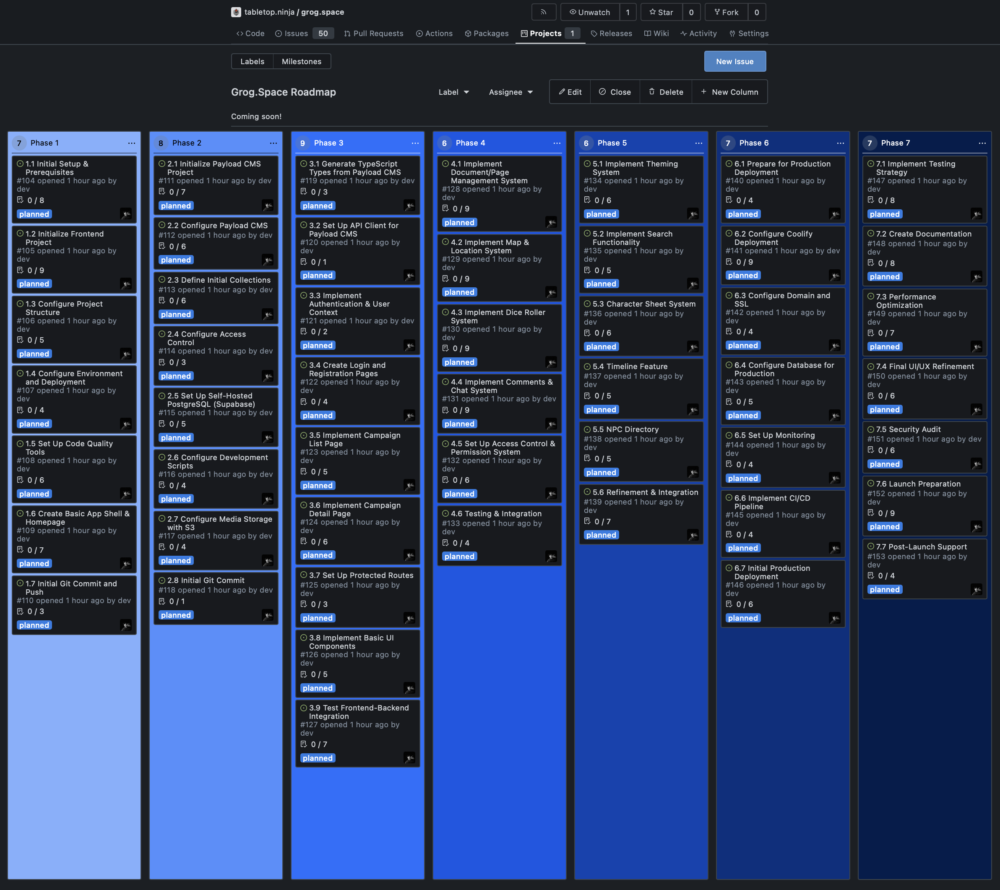

# issueForged

A simple yet powerful Python utility that converts Markdown files, specifically outline or task lists, into Gitea/GitHub Issues, then onto Git Projects as needed.

## Overview

issuePhorge is designed to streamline the process of converting structured Markdown documents into formal issues in your Git repository where they can be added to your projects. It's particularly useful for teams who plan in Markdown and want to seamlessly transfer their planning documents into actionable tasks in their issue tracking system then onto their projects feature in Git.



## Features

- **Header-Based Issue Creation**: Automatically converts specified header levels in your Markdown file into issue titles.
- **Smart Content Parsing**: Uses everything between headers as the issue body, including task lists and code blocks.
- **Flexible Header Selection**: Choose which header level (H1, H2, H3, etc.) should be treated as issue titles.
- **Multiple Operating Modes**:
  - **TEST MODE**: Create only the first issue to verify configuration.
  - **FULL MODE**: Create all issues at once.
  - **FINIKY MODE**: Selectively choose which headers to convert to issues.
- **Configuration Management**: Save your settings in `issueForged.conf` for future use.
- **Automatic Label Handling**: Fetches and displays available labels from your repository and automatically maps label names to required IDs.
- **Customizable Issue Parameters**: Set assignees and labels for created issues.

## Requirements

- Python 3.6+
- **Access to a Git Repository**: Required to have appropriate permissions to create issues on your Gitea or GitHub repository.
- **Valid API Token**: Required to authenticate your requests with your Git service.

## Installation

1. Download the script to your local machine. You can clone the repository or download the latest `issueForged.py` file.

## Configuration

When you first run issuePhorge, you'll be prompted to configure the following settings:

1. **Input File**: Path to your Markdown file containing tasks.
2. **Header Level**: Which header level to use for issue titles (e.g., H1, H2, H3, etc.).
3. **Repository API URL**: The complete URL to your repository's Issues API endpoint.
   - For Gitea: `https://your-gitea-instance.com/api/v1/repos/username/repository/issues`
   - For GitHub: `https://api.github.com/repos/username/repository/issues`
4. **API Token**: Your personal access token for the Git service.
5. **Headers to Ignore**: Patterns for headers that should be excluded (e.g., "# Phase").
6. **Issue Assignee**: Default username to assign issues to.
7. **Label Name**: Name of the label to apply to issues.

All settings are saved to `issueForged.conf` in the same directory as the script for future use.

## Usage

Structure your Markdown file with consistent header levels to prepare it for processing. For example:

```
# Project Overview

This is an overview of the project and won't become an issue.

## 1.1 Initial Repository Setup

### 1.1.1 Create Basic Structure
- [ ] Initialize git repository
- [ ] Add README.md with project description
- [ ] Create .gitignore file

## 1.2 Documentation Setup

### 1.2.1 Create Wiki Pages
- [ ] Create Project Overview page
- [ ] Add Development Guidelines
```

In this example, if you choose level 2 (##) as your header level, "1.1 Initial Repository Setup" and "1.2 Documentation Setup" will become issue titles, and everything beneath each until the next level 2 header will be included in the issue body.

### Running the Script

You can execute the script from your terminal or command prompt:

**MacOS / Linux:**

```
python3 issueForged.py
```

**Windows:**

```
python issueForged.py
```

### Sample Prompt

Here is a preview of the interactive terminal prompts you will see when configuring the script manually for the first time:

```
::: issueForged :::

This simple Python script converts the headers (#, ##, ###, etc.) in a GitHub-flavored markdown file into Gitea/GitHub issues. If this is your first time using issuePhorge, your selected options will create a config file for future use: Option 1 below; otherwise, choose Option 2...

Config Options:
1. Use existing configuration
2. Select options manually
3. Exit

Enter the config option (1-3):
> 2

Enter the markdown file path and name...
Markdown file path [_docs/my_markdown_file.md]:
> tasks.md

Analyzing header levels in the file...

I found the following header levels in your file:
1: # (Found in file: # Project Overview)
2: ## (Found in file: ## 1.1 Initial Repository Setup, ## 1.2 Documentation Setup)
3: ### (Found in file: ### 1.1.1 Create Basic Structure, ### 1.2.1 Create Wiki Pages)

Which header levels do you wish to use as the issue titles? Everything else between these headers will be sent to the body of the issue. Higher header levels will be ignored...
Desired header level (1-6) [header 2 is default]:
> 2

...I'm now using headers 2 (##) for issue titles and added this to the config.
```

### Example Workflow

1. **Plan your project**: Draft your project in a Markdown file with structured headers and task lists.
2. **Run the script**: Execute the script and follow the configuration prompts to set your preferences.
3. **Select your operating mode**: Use TEST MODE first to verify the initial issue formats correctly.
4. **Check your output**: Review your repository's issue tracker to verify the results, then proceed with FULL or FINIKY mode.

## Advanced Features

- **Ignoring Specific Headers**: You can specify header patterns to ignore, such as section dividers or overview sections that you don't want to convert to issues.
- **Label Management**: issueForged fetches all available labels from your repository and displays them for you to choose from. You only need to provide the label name - the script automatically handles finding and using the correct label ID required by the API.
- **Batch Processing**: When creating multiple issues, issueForged asks for confirmation every few issues, allowing you to monitor the creation process and stop if needed.

## Troubleshooting

- **API Connection Issues**: Verify your API URL and token are correct.
- **No Headers Found**: Ensure your Markdown file contains headers at the selected level.
- **Label Not Found**: Check that the label name exactly matches one in your repository.
- **Unexpected Formatting**: View the issue in TEST MODE before creating all issues to ensure your markdown parsing behaves as expected.

## License

This project is licensed under the GNU General Public License v3.0 (GPL-3.0). You are free to use, modify, and distribute this software, provided that you:

- Disclose the source code of any modifications you make.
- License your modified versions under the same GPL-3.0 license.
- Preserve the original copyright notices and disclaimers. See the LICENSE file for the complete text of the GPL-3.0 license.